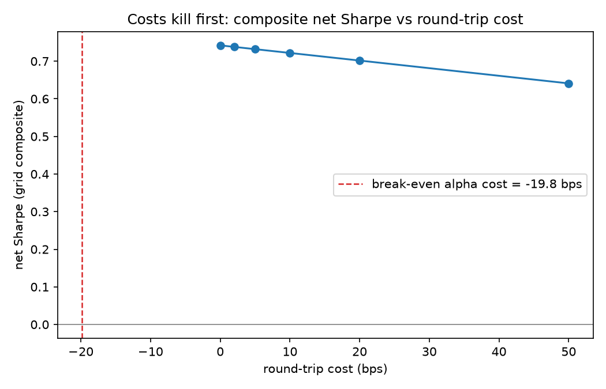

# sector-momentum-audit

**Does sector momentum survive costs, beta, and honest evaluation? A
pre-registered audit on the nine original SPDR sector ETFs, 2000–2025.**


This is not a strategy repository. The strategy is deliberately the most
ordinary one in the literature — cross-sectional momentum, monthly top-k.
The product is the **evaluation protocol** wrapped around it: every rule,
parameter, and success criterion was written and committed **before any
backtest ran** ([PROTOCOL.md](PROTOCOL.md), the repository's first commit),
and the out-of-sample verdict below was produced by a **single,
pre-registered holdout run** whose criteria could not be adjusted after the
fact.

> ## Finding (holdout 2016–2025, run once)
>
> Sector momentum did **not** survive the audit.
>
> - Median net Sharpe across the frozen 24-cell parameter grid, at 10 bps
>   round-trip costs: **0.71** — versus **0.79** for the honest benchmark
>   (all nine sectors equal-weighted, same rebalance schedule, same costs).
>   **The strategy family lost to doing nothing clever.**
> - CAPM vs SPY: **alpha = −1.1%/yr**, Newey–West t = **−0.48** (lag 21),
>   beta = **0.90**. Pre-registered verdict: **cannot reject zero alpha.**
> - The falsification clause fired: alpha is negative before costs, so
>   there is no cost level at which the strategy becomes attractive.
> - I report the grid **median**, because the best cell is exactly what
>   in-sample selection would have handed me. All 24 cells are published
>   in [results/grid_holdout.csv](results/grid_holdout.csv).
> - Selection shrinkage, measured: the design-period champion
>   (lb 126 / skip 21 / k 4) scored 0.53 in-sample and 0.71 out-of-sample —
>   but so did everything else in a bull decade. Relative skill did not
>   survive; the champion still trails EW9.



## Reproduce every number in 60 seconds

```bash
git clone https://github.com/Kuilin-Zhang/sector-momentum-audit.git
cd sector-momentum-audit
pip install -r requirements.txt
python -m pytest -q        # 11 research-invariant tests
python run_all.py          # design period  (2000-2015)
python run_holdout.py      # holdout        (2016-2025)
```

No network access needed: both price snapshots are committed
(`data/prices_design.csv`, `data/prices_holdout.csv`; SHA-256 fingerprints
in [NOTES.md](NOTES.md)).

## Timing contract

| Step | When | Price involved |
|---|---|---|
| Compute momentum signal | day t, after the close | closes up to and including t |
| Select top-k portfolio | day t, after the close | — |
| New weights take effect | day t+1, at the close | close of t+1 |
| First PnL accrues | t+1 close → t+2 close | close-to-close |

One day is the minimum lag that eliminates lookahead entirely; any further
delay buys nothing and costs signal freshness. Costs are charged as
half-sum turnover × round-trip rate, deducted from the first accrual day of
the new weights. Where the backtest is ambiguous, the ambiguity is resolved
against the strategy.

## Why this universe

The nine original SPDR sector ETFs (XLB XLE XLF XLI XLK XLP XLU XLV XLY)
were all listed on the same day in 1998 and none has ever been delisted: a
1998 investor could have formed the identical list using only information
available that day, so the sample is **survivorship-free by construction**
— not by argument. XLRE (2015) and XLC (2018) are deliberately excluded;
real estate lived inside XLF and communications inside XLK/XLY throughout,
so no sector is missing.

## The run-once mechanism

The holdout period (2016–2025) was fenced off before any code existed. The
design analysis was completed and committed, the repository was tagged
[`design-freeze`](https://github.com/Kuilin-Zhang/sector-momentum-audit/releases),
and **only then** was the holdout data fetched — in the same commit as the
holdout results, so the git history itself shows the data could not have
been peeked at earlier. I cannot prove I never peeked; what this mechanism
proves is that peeking could not have changed anything, because every
definition was closed before the freeze.

## What the tests defend

Eleven research-invariant tests run in CI — they test the research, not
toy functions:

- **Leakage positive control**: a deliberately cheating signal built from
  *future* returns must produce Sharpe > 3 on a random walk, and the honest
  pipeline on the same data must not. If the harness can't tell them apart,
  it is blind.
- **Golden ledger**: a two-asset, hand-computed cycle pins entry cost
  timing, drift arithmetic, half-sum turnover, and bps conversion to
  15 decimal places.
- **Benchmark identity**: at zero cost with k = 9, the strategy *is* the
  equal-weight benchmark, pointwise to 1e-10.
- **Cost linearity**: net returns are affine in the cost rate (this is what
  lets the break-even cost be solved exactly instead of interpolated).
- **Statistics oracle**: the hand-written OLS and Newey–West estimators
  match statsmodels to 1e-10 / 1e-6.
- Plus: data contract, signal sanity, turnover bounds, composite window
  placement, tie-break determinism, cost monotonicity.

## Limitations

- Risk-free rate set to zero: Sharpe ratios are overstated by roughly 0.1,
  uniformly across strategy and benchmarks.
- Nine assets, one market, long-only, monthly frequency. Conclusions are
  about this design, not about momentum everywhere.
- Costs are a flat rate on turnover; no market impact model.
- Annualized return uses the arithmetic convention (mean × 252).
- The holdout period (2016–2025) is not epistemically out-of-sample for an
  author working in 2026: the decay of sector momentum is public knowledge,
  and a null verdict was plausible ex ante. The contribution of this
  repository is the mechanism, not the finding.
- The commit history shows the study was built in a single day. The
  pre-registration mechanism constrains decision freedom, not construction
  speed — but a fair reader may still discount a one-day history as a
  demonstration rather than a habit. The planned v2 protocol (below), with
  a deliberately delayed holdout, is the answer to that discount.

## What I would do next

- A v2 protocol (pre-registered before any new result) testing whether the
  EW9 gap is regime-dependent rather than uniform.
- FRED 3-month T-bill as the risk-free leg.
- Bootstrap confidence intervals on the Sharpe gap versus EW9.
